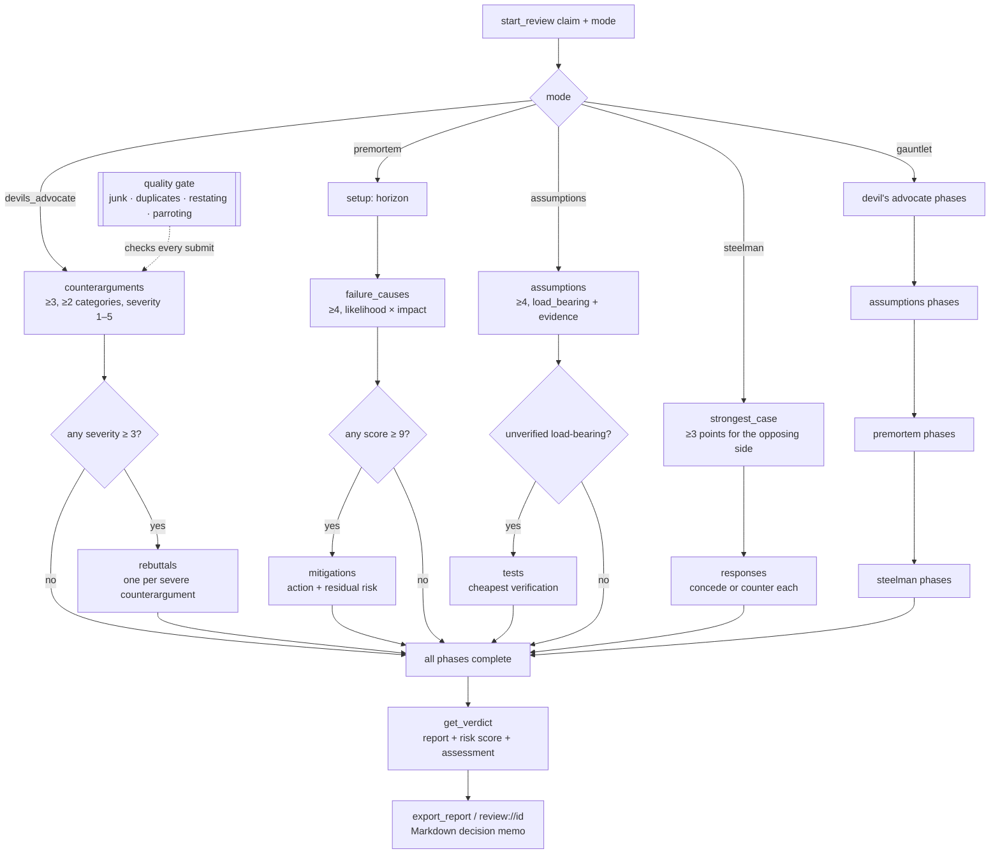

# mcp-devils-advocate

<!-- mcp-name: io.github.AleBrito124356/mcp-devils-advocate -->

[](https://github.com/AleBrito124356/mcp-devils-advocate/actions/workflows/tests.yml)


[](LICENSE)

**MCP server that stress-tests reasoning: devil's advocate, premortem analysis, assumption audits, steelmanning and an all-in-one gauntlet, run as enforced, structured protocols.**

## Why

LLMs agree too easily. Ask one whether your plan is good and you get a polite yes with three bullet points. This server makes it harder to shortcut adversarial thinking. It never writes content itself. It is a state machine that makes the client LLM finish each phase properly: minimum counts, categories, severity ratings and length floors. It checks every submission and returns errors the model can act on. It will not move to the next phase until the current one is complete. At the end it writes a report with a deterministic assessment.

Length floors alone are easy to game, so every submission also goes through a **quality gate** (see [below](#quality-gate)). It rejects padding (`"x" * 30`), near-duplicate items, "counterarguments" that only restate the claim, and rebuttals, mitigations, tests or responses copied from the item they answer. Nothing is saved until the whole batch passes. The gate uses deterministic text heuristics, not a semantic judge. It stops lazy and degenerate submissions. It cannot prove that an argument is *good*.

Five modes:

| Mode | Protocol |
|---|---|
| `devils_advocate` | ≥3 counterarguments (categorized, severity 1–5, ≥2 distinct categories) → honest rebuttal of every severity ≥3 counterargument (`holds` / `partially_holds` / `refuted`) → verdict |
| `premortem` | set a failure horizon → ≥4 failure causes (likelihood × impact) → concrete mitigation for every cause scoring ≥9, with residual risk → verdict |
| `assumptions` | ≥4 assumptions (`load_bearing`, evidence `verified`/`partial`/`none`) → a cheap verification test for every unverified load-bearing assumption → verdict |
| `steelman` | ≥3 strongest points for the OPPOSING position → honest `concede` or `counter` response to each → verdict |
| `gauntlet` | all four lenses on the same claim, in this order: devil's advocate → assumptions → premortem → steelman (9 phases). Each lens gets its own verdict and a combined verdict is computed from them |

## Tools

| Tool | Arguments | Returns |
|---|---|---|
| `start_review` | `claim: str`, `mode: str`, `context: str = ""` | New `review_id` (e.g. `rev-x9k2`), the list of phases, and exact instructions for the first phase: item format, rules, minimums and quality checks. The claim and `context` are repeated in every phase's instructions |
| `submit` | `review_id: str`, `items: list[dict]` | Validates the whole batch at once. Returns `in_progress` (+ `missing` list), `phase_complete` (+ next phase's instructions) or `complete`. If any item is invalid, the error lists every problem and nothing is saved |
| `get_verdict` | `review_id: str` | Only when all phases are complete. The compiled report: claim, every item organized by phase (rebuttals/mitigations/tests/responses attached to their targets), aggregate risk score, and the assessment with its rules. Gauntlet reports add one sub-verdict per lens under `lenses` |
| `export_report` | `review_id: str`, `format: str = "markdown"` | A completed review as a shareable **decision memo** (Markdown, see below) or as JSON (`"json"`) |
| `get_review` | `review_id: str` | Where a review stands: status, step (e.g. `5/9`), items per phase, what is still missing, and the current phase's instructions. Useful for resuming |
| `list_reviews` | — | All reviews, newest first: id, claim snippet, mode, status, current phase, timestamps. Files in the data directory that are not valid reviews are listed under `skipped` and do not break the listing |
| `abandon_review` | `review_id: str`, `reason: str` | Marks an unfinished review as abandoned. It stays listed for the record and accepts no more submissions. A completed review cannot be abandoned because its verdict is final |

Every validation error reaches the model word for word under both SDK generations, for example ``item 1: 'text' is a near-duplicate of item 0 (similarity 1.00) — each counterargument must make a distinct point``. Under mcp 2.x a plain exception in a tool shows up as just `Error executing tool submit`, so the server converts every validation error into the SDK's `ToolError`. The end-to-end tests check this.

## Resources & prompts

| Kind | Name | What it gives |
|---|---|---|
| Resource | `reviews://` | The review listing as JSON (same content as `list_reviews`) |
| Resource template | `review://{review_id}` | The Markdown decision memo of a completed review, or a progress page (phase, step, what is missing) for an active or abandoned one |
| Prompt | `stress_test(claim, mode="devils_advocate")` | Step-by-step instructions for running the whole protocol in the chosen mode. A client like Claude Desktop can offer it from the prompt picker. An unknown mode returns an invalid-params error that lists the valid modes |

## Quality gate

Text is compared as sets of *content words*. The text is lowercased, accents are stripped and punctuation is removed. A small English + Spanish stopword and filler list is dropped (negations included, so "we should **not** do X" adds nothing to "we should do X"). A tiny stemmer then makes `rewrite`/`rewriting` and `service`/`services` count as the same word. The thresholds are constants in [`quality.py`](mcp_devils_advocate/quality.py), and every phase's instructions list them under `quality_checks`.

| Check | Applies to | Rejected when |
|---|---|---|
| Low information | every free-text field | fewer than 4 distinct content words (counterarguments, steelman points) or 3 (everything else). Keyboard-mash tokens like `xxxxxx` do not count. With 6+ content words, one word may not make up more than 50% of them |
| Near-duplicate | every item against the others in the same phase, both in this batch and already saved | Jaccard word overlap ≥ 0.8 |
| Restating the claim | counterarguments, steelman points, rebuttal justifications, `counter` responses | ≥ 80% of the content words come from the claim, or fewer than 2 new ones |
| Parroting the target | rebuttals, mitigations, tests, responses (both `concede` and `counter`) | ≥ 80% of the content words are copied from the item being answered, or fewer than 2 new ones |

All four shortcuts found in the 0.1.0 audit now fail with a message that names the item, and nothing is saved: 30 × `x`, one counterargument pasted under three categories, `counter` responses that repeat the claim, and justifications copied from the counterargument. Each of them used to end in "claim survives scrutiny". [`tests/test_quality.py`](tests/test_quality.py) keeps them as regression tests, next to the README example below, which still passes unchanged.

## Assessment rules (deterministic)

| Mode | Risk score | `claim refuted` | `claim needs revision` | `claim survives scrutiny` |
|---|---|---|---|---|
| `devils_advocate` | # counterarguments that `holds` after rebuttal | ≥2 hold, or any severity-5 holds | exactly 1 holds, or ≥2 partially hold | otherwise |
| `premortem` | average likelihood × impact (1–25) | average > 12 | average > 6, or any mitigation with `high` residual risk | otherwise |
| `assumptions` | # unverified load-bearing assumptions | ≥2 load-bearing with evidence `none` | exactly 1 with `none`, or ≥2 with `partial` | otherwise |
| `steelman` | # opposing points conceded | every point conceded | concessions ≥ counters | counters outnumber concessions |
| `gauntlet` | 2 per refuting lens + 1 per lens needing revision (0–8) | ≥2 lenses refute | exactly 1 lens refutes, or ≥2 lenses need revision | otherwise |

In a gauntlet, each lens is assessed with its own rule above, applied to the same review.

## How it works



Every `submit` is checked in two layers, and the whole batch passes or fails together. First the fields are validated (types, enums, ranges, length floors, target indices). Then the quality gate runs. The server only moves on when the phase's requirements are met. It skips dependent phases that have no targets, for example when no counterargument reached severity 3. State is saved as one JSON file per review in `~/.mcp-devils-advocate/` (override it with the `DEVILS_ADVOCATE_DIR` environment variable). Reviews written by 0.1.0 still load.

## Quickstart

> **Not on PyPI yet.** The `publish.yml` workflow uploads to PyPI (and the MCP Registry entry in `server.json` points there) when a `v*` tag is pushed. No release has been tagged yet, so `pip install mcp-devils-advocate` / `uvx mcp-devils-advocate` do not work. Until then, install from GitHub:

**Claude Desktop** (`claude_desktop_config.json`):

```json
{
  "mcpServers": {
    "devils-advocate": {
      "command": "uvx",
      "args": ["--from", "git+https://github.com/AleBrito124356/mcp-devils-advocate", "mcp-devils-advocate"]
    }
  }
}
```

**Claude Code:**

```bash
claude mcp add devils-advocate -- uvx --from git+https://github.com/AleBrito124356/mcp-devils-advocate mcp-devils-advocate
```

**pip** (permanent install, then use `mcp-devils-advocate` as the command):

```bash
pip install "git+https://github.com/AleBrito124356/mcp-devils-advocate"
```

With no arguments, `mcp-devils-advocate` runs the stdio MCP server, the same as in 0.1.0, so existing client configs keep working.

## Example session

> **User:** We're considering rewriting our backend in Rust. Play devil's advocate before we commit.

The assistant calls `start_review(claim="We should rewrite our backend in Rust", mode="devils_advocate")` and receives (abridged):

```json
{
  "review_id": "rev-k4d7",
  "status": "active",
  "phases": ["counterarguments", "rebuttals"],
  "instructions": {
    "phase": "counterarguments",
    "step": "1/2",
    "claim": "We should rewrite our backend in Rust",
    "goal": "Attack the claim as a devil's advocate. Generate the strongest, most specific counterarguments you can — no strawmen.",
    "item_format": {
      "text": "str, >= 30 characters — the counterargument, concrete and falsifiable",
      "category": "one of: evidence, incentives, base_rates, alternatives, second_order, scope",
      "severity": "int 1-5 — how damaging to the claim if true (5 = fatal)"
    },
    "rules": [
      "Submit at least 3 counterarguments (send them all in one call).",
      "Use at least 2 distinct categories.",
      "Every counterargument with severity >= 3 must be rebutted in the next phase — assign severity honestly."
    ],
    "quality_checks": [
      "'text' needs at least 4 distinct content words (...) — junk padding is rejected.",
      "Each counterargument must be distinct: a Jaccard word-overlap of >= 0.8 with another counterargument in this phase is rejected as a near-duplicate.",
      "A counterargument that only restates the claim (>= 80% of its content words from the claim, or fewer than 2 new ones) is rejected."
    ]
  }
}
```

The assistant does the actual thinking and calls `submit`:

```json
submit("rev-k4d7", [
  {"text": "Full rewrites of working systems fail or massively overrun far more often than they succeed; incremental strangler migrations have much better base rates.", "category": "base_rates", "severity": 4},
  {"text": "The team has zero production Rust experience; hiring and ramp-up costs will land exactly while feature delivery is frozen.", "category": "evidence", "severity": 4},
  {"text": "Profiling shows the bottleneck is the database layer, not CPU — a rewrite optimizes the part that isn't slow.", "category": "alternatives", "severity": 5},
  {"text": "Engineers pushing the rewrite are the ones who want Rust on their CV — incentives are not aligned with the business case.", "category": "incentives", "severity": 2}
])
```

The server validates the batch, marks the phase complete, and returns the `rebuttals` phase with three targets (the severity ≥3 items). The assistant rebuts each one honestly:

```json
submit("rev-k4d7", [
  {"index": 0, "verdict": "partially_holds", "justification": "True in general, but we can scope the rewrite to the two stateless services first, which is effectively a strangler migration."},
  {"index": 1, "verdict": "holds", "justification": "No honest rebuttal: nobody on the team has shipped Rust, and the hiring market for it is thin in our region."},
  {"index": 2, "verdict": "holds", "justification": "The profiling data is real — the p99 latency lives in Postgres queries. A Rust rewrite does not touch that."}
])
```

All phases are complete, so `get_verdict("rev-k4d7")` compiles the report:

```json
{
  "review_id": "rev-k4d7",
  "claim": "We should rewrite our backend in Rust",
  "mode": "devils_advocate",
  "risk_score": {"value": 2, "scale": "0-3 counterarguments that held after rebuttal"},
  "assessment": "claim refuted",
  "assessment_reason": "Of 3 rebutted counterargument(s): 2 hold, 1 partially hold, 0 refuted; a severity-5 counterargument holds. Rules: refuted if >=2 hold or any severity-5 holds; ..."
}
```

`export_report("rev-k4d7")` then returns the decision memo shown in the demo below, with a **Next actions** checklist the team can paste into an issue.

> **Assistant:** The claim did not survive scrutiny. Two counterarguments held, including a severity-5 one: our bottleneck is the database, not CPU, so a Rust rewrite attacks the wrong problem — and we have no Rust experience in-house. Recommendation: fix the query layer first; if CPU ever becomes the bottleneck, migrate one stateless service as a pilot.

## CLI

The same command works on the review files without an LLM client and without importing the MCP SDK:

| Command | What it does |
|---|---|
| `mcp-devils-advocate` / `mcp-devils-advocate serve` | Run the stdio MCP server (the default) |
| `mcp-devils-advocate list [--json]` | Every review, newest first. Malformed files are reported as warnings |
| `mcp-devils-advocate show <id> [--json]` | Status, progress, what is missing, and the current phase's instructions |
| `mcp-devils-advocate report <id> [--format md\|json] [-o FILE]` | Export a completed review as a decision memo or JSON |
| `mcp-devils-advocate demo [--mode MODE] [--memo-only]` | Offline scripted review through the real `ReviewStore`. Needs no LLM, no network and no keys, and its output is deterministic |

`--data-dir DIR` (before or after the command) overrides `DEVILS_ADVOCATE_DIR`. `python -m mcp_devils_advocate ...` is equivalent. For `demo`, `--data-dir` keeps the review so that `list`/`show`/`report` can open it afterwards. Otherwise it runs in a temporary directory and deletes it at the end. Try `demo --mode gauntlet --memo-only` for the full four-lens memo.

This is the real output of `mcp-devils-advocate demo`. A test checks it against the code, so it cannot go stale:

<details>
<summary>Full <code>demo</code> output (91 lines)</summary>

<!-- demo-output:start -->
```text
Offline demo: no LLM, no network. A scripted client plays the model and runs a
'devils_advocate' review through the real ReviewStore.

start_review(claim='We should rewrite our backend in Rust', mode='devils_advocate', context=...)
  -> rev-ess4, phases: counterarguments -> rebuttals

== Phase 1/2: counterarguments ==
Goal: Attack the claim as a devil's advocate. Generate the strongest, most specific counterarguments you can — no strawmen.
Item format:
  text: str, >= 30 characters — the counterargument, concrete and falsifiable
  category: one of: evidence, incentives, base_rates, alternatives, second_order, scope
  severity: int 1-5 — how damaging to the claim if true (5 = fatal)
Rules:
  - Submit at least 3 counterarguments (send them all in one call).
  - Use at least 2 distinct categories.
  - Every counterargument with severity >= 3 must be rebutted in the next phase — assign severity honestly.
Quality checks:
  - 'text' needs at least 4 distinct content words (stopwords and filler like 'good', 'bad', 'really' do not count), and once it has 6+ content words no single word may make up more than 50% of them — junk padding is rejected.
  - Each counterargument must be distinct: a Jaccard word-overlap of >= 0.8 with another counterargument in this phase is rejected as a near-duplicate.
  - A counterargument that only restates the claim (>= 80% of its content words from the claim, or fewer than 2 new ones) is rejected.

A lazy client pastes one counterargument under three categories:
  REJECTED — Invalid submission — nothing was saved. Fix these problems and resubmit:
  - item 1: 'text' is a near-duplicate of item 0 (similarity 1.00) — each counterargument must make a distinct point
  - item 2: 'text' is a near-duplicate of item 0 (similarity 1.00) — each counterargument must make a distinct point
The real client does the thinking instead.

submit(rev-ess4, 4 item(s)):
  [base_rates, severity 4] Full rewrites of working systems fail or massively overrun far more often than they succeed; in…
  [evidence, severity 4] The team has zero production Rust experience; hiring and ramp-up costs will land exactly while …
  [alternatives, severity 5] Profiling shows the bottleneck is the database layer, not CPU — a rewrite optimizes the part th…
  [incentives, severity 2] Engineers pushing the rewrite are the ones who want Rust on their CV — incentives are not align…
  -> phase_complete; next phase: rebuttals

== Phase 2/2: rebuttals ==
Goal: Rebut each high-severity counterargument honestly. If you cannot refute one, admit that it holds.
Targets: 3 (#0, #1, #2)
Item format:
  index: int — index of the counterargument being rebutted (see 'targets')
  verdict: one of: holds, partially_holds, refuted — does the counterargument survive your rebuttal?
  justification: str, >= 20 characters — why that verdict
Rules:
  - Provide exactly one rebuttal per target (3 pending).
  - 'holds' means the counterargument stands and damages the claim. Do not mark 'refuted' without an actual refutation.
Quality checks:
  - 'justification' needs at least 3 distinct content words (stopwords and filler like 'good', 'bad', 'really' do not count), and once it has 6+ content words no single word may make up more than 50% of them — junk padding is rejected.
  - Each rebuttal must be distinct: a Jaccard word-overlap of >= 0.8 with another rebuttal in this phase is rejected as a near-duplicate.
  - A rebuttal that only restates the claim (>= 80% of its content words from the claim, or fewer than 2 new ones) is rejected.
  - A rebuttal that parrots the counterargument it answers (>= 80% of its content words copied, or fewer than 2 new ones) is rejected.

submit(rev-ess4, 3 item(s)):
  #0 partially_holds: True in general, but we can scope the rewrite to the two stateless services first, which is eff…
  #1 holds: No honest rebuttal: nobody on the team has shipped Rust, and the hiring market for it is thin i…
  #2 holds: The profiling data is real — the p99 latency lives in Postgres queries. A Rust rewrite does not…
  -> complete: All phases complete. Call get_verdict('rev-ess4') to compile the final report.

get_verdict(rev-ess4) -> claim refuted (risk score 2: 0-3 counterarguments that held after rebuttal)

export_report(rev-ess4, format='markdown'):

# Decision memo: We should rewrite our backend in Rust

- **Review:** `rev-ess4` · mode `devils_advocate` (Devil's advocate)
- **Assessment:** **claim refuted**
- **Risk score:** 2 — 0-3 counterarguments that held after rebuttal
- **Started:** 2026-01-15T09:00:00+00:00 · **Completed:** 2026-01-15T09:02:00+00:00

**Context:** 9-year-old Python monolith, 14 engineers, enterprise customers complaining about p99 latency.

## Verdict

**claim refuted** — Of 3 rebutted counterargument(s): 2 hold, 1 partially hold, 0 refuted; a severity-5 counterargument holds. Rules: refuted if >=2 hold or any severity-5 holds; revision if exactly 1 holds or >=2 partially hold; survives otherwise.

## Counterarguments

- **#0 · base_rates · severity 4** — Full rewrites of working systems fail or massively overrun far more often than they succeed; incremental strangler migrations have much better base rates.
  - Rebuttal (*partially holds*): True in general, but we can scope the rewrite to the two stateless services first, which is effectively a strangler migration.
- **#1 · evidence · severity 4** — The team has zero production Rust experience; hiring and ramp-up costs will land exactly while feature delivery is frozen.
  - Rebuttal (*holds*): No honest rebuttal: nobody on the team has shipped Rust, and the hiring market for it is thin in our region.
- **#2 · alternatives · severity 5** — Profiling shows the bottleneck is the database layer, not CPU — a rewrite optimizes the part that isn't slow.
  - Rebuttal (*holds*): The profiling data is real — the p99 latency lives in Postgres queries. A Rust rewrite does not touch that.
- **#3 · incentives · severity 2** — Engineers pushing the rewrite are the ones who want Rust on their CV — incentives are not aligned with the business case.
  - _severity below 3 — no rebuttal required_

## Next actions

- [ ] Resolve counterargument #0 (partially holds, severity 4): Full rewrites of working systems fail or massively overrun far more often than they succeed; incremental strangler migrations have much better base rates.
- [ ] Resolve counterargument #1 (holds, severity 4): The team has zero production Rust experience; hiring and ramp-up costs will land exactly while feature delivery is frozen.
- [ ] Resolve counterargument #2 (holds, severity 5): Profiling shows the bottleneck is the database layer, not CPU — a rewrite optimizes the part that isn't slow.

<sub>Generated by mcp-devils-advocate from review `rev-ess4`.</sub>
```
<!-- demo-output:end -->

</details>

## Compatibility

| | Tested |
|---|---|
| Python | 3.10+ (developed and tested on 3.14) |
| MCP Python SDK | 1.5.0, 1.9.0, 1.30.0 (`mcp.server.fastmcp.FastMCP`) and 2.2.0 (`mcp.server.mcpserver.MCPServer`). The whole suite, including the stdio end-to-end tests, passes on each |

The dependency is `mcp>=1.5.0,<3`. SDKs before 1.3 write stdout in the Windows code page, so any non-ASCII text (an em dash, a Spanish accent) corrupts the JSON-RPC stream. The 1.3/1.4 stdio *client* hangs on Windows, which is why 1.5.0 is the lowest version the end-to-end suite can verify. The upper bound keeps a future 3.x from breaking installs silently, as 2.0 did to 0.1.0.

## Development

```bash
git clone https://github.com/AleBrito124356/mcp-devils-advocate
cd mcp-devils-advocate
python -m venv .venv && .venv/bin/pip install -e ".[dev]"   # Windows: .venv\Scripts\pip
.venv/bin/python -m pytest
```

Run the server from the source tree with `python -m mcp_devils_advocate` (or `python -m mcp_devils_advocate.server`).

The suite has 140+ tests, all offline:

- `test_core.py`: phase machine, validation, verdict rules and persistence. It also covers the lifecycle fixes: complete reviews can't be abandoned, malformed files are skipped, same-second ordering is stable, context reaches every phase, and 0.1.0 files still load.
- `test_quality.py`: every quality check on both sides of its threshold, the four audit exploits, and the README example as a regression test.
- `test_gauntlet.py`: the nine-phase flow, auto-skipped phases, and every branch of the combined rule.
- `test_memo.py`: the memo has every section in all five modes, and Next actions matches the open work.
- `test_cli.py`: `demo`, `list`, `show`, `report` and error exits, run as real subprocesses.
- `test_server_e2e.py`: starts the real server (module and console script) and drives it over stdio with the official SDK client. It covers tools, resources, the prompt, a full flow, a gauntlet, and error messages reaching the model word for word.

`mcp_devils_advocate/core.py`, `quality.py` and `memo.py` use only the standard library, and every test except `test_server_e2e.py` runs without `mcp` (that file is skipped when the SDK is missing). To check the other SDK generation, install it into a second venv: `pip install -e . "mcp<2" pytest`, then run `python -m pytest`.

## Related MCP servers

Part of a family of small, dependency-light MCP servers:

- [mcp-decision-lab](https://github.com/AleBrito124356/mcp-decision-lab) — weighted decision matrices with sensitivity analysis
- [mcp-secret-sentinel](https://github.com/AleBrito124356/mcp-secret-sentinel) — scan code for exposed secrets, always redacted
- [mcp-git-historian](https://github.com/AleBrito124356/mcp-git-historian) — churn hotspots, blame summaries, bus factor
- [mcp-memory-vault](https://github.com/AleBrito124356/mcp-memory-vault) — persistent memory with SQLite FTS5 search

## License

MIT
