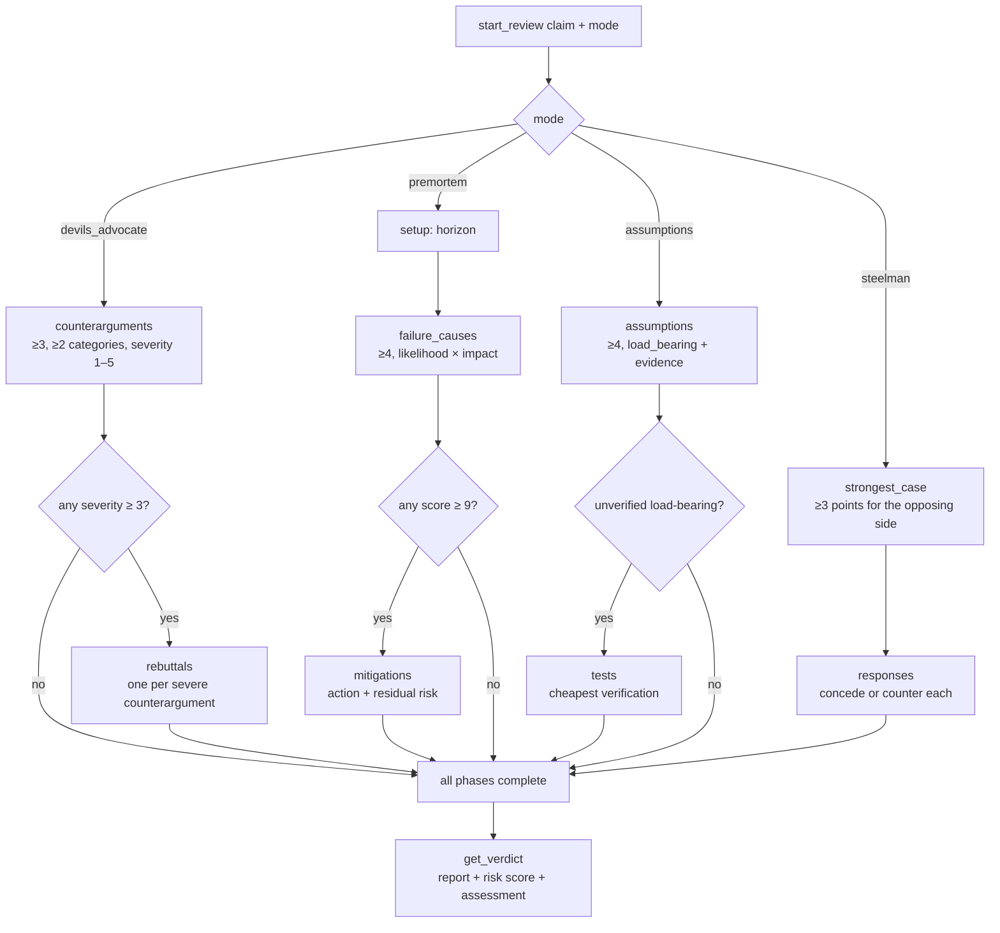

# mcp-devils-advocate

<!-- mcp-name: io.github.AleBrito124356/mcp-devils-advocate -->

[](https://github.com/AleBrito124356/mcp-devils-advocate/actions/workflows/tests.yml)
[](https://pypi.org/project/mcp-devils-advocate/)
[](https://pypi.org/project/mcp-devils-advocate/)
[](LICENSE)

**MCP server that stress-tests reasoning — devil's advocate, premortem analysis, assumption audits and steelmanning as enforced, structured protocols.**

## Why

LLMs agree too easily. Ask one whether your plan is good and you get a polite yes with three bullet points. This server fixes that by turning adversarial thinking into a protocol the model cannot shortcut: it never generates content itself — it is a state machine that forces the client LLM to complete each phase with rigor (minimum counts, categories, severity ratings, length floors), validates every submission with actionable errors, refuses to advance until a phase is genuinely complete, and compiles a final report with a deterministic assessment. The result: real counterarguments instead of token pushback, premortems with mitigation obligations, assumption audits that flag what is load-bearing and unverified, and steelmen the opposing side would actually endorse.

Four modes:

| Mode | Protocol |
|---|---|
| `devils_advocate` | ≥3 counterarguments (categorized, severity 1–5, ≥2 distinct categories) → honest rebuttal of every severity ≥3 counterargument (`holds` / `partially_holds` / `refuted`) → verdict |
| `premortem` | set a failure horizon → ≥4 failure causes (likelihood × impact) → concrete mitigation for every cause scoring ≥9, with residual risk → verdict |
| `assumptions` | ≥4 assumptions (`load_bearing`, evidence `verified`/`partial`/`none`) → a cheap verification test for every unverified load-bearing assumption → verdict |
| `steelman` | ≥3 strongest points for the OPPOSING position → honest `concede` or `counter` response to each → verdict |

## Tools

| Tool | Arguments | Returns |
|---|---|---|
| `start_review` | `claim: str`, `mode: str`, `context: str = ""` | New `review_id` (e.g. `rev-x9k2`) plus exact instructions for the first phase: item format, rules, minimums |
| `submit` | `review_id: str`, `items: list[dict]` | Atomic validation of the batch. `in_progress` (+ `missing` list), `phase_complete` (+ next phase instructions), or `complete`. Invalid items raise an error listing every problem; nothing is saved |
| `get_verdict` | `review_id: str` | Only when all phases are complete: compiled report — claim, all items organized (rebuttals/mitigations/tests/responses attached to their targets), aggregate risk score, and assessment with documented rules |
| `list_reviews` | — | All reviews: id, claim snippet, mode, status, current phase, timestamps |
| `abandon_review` | `review_id: str`, `reason: str` | Marks the review abandoned (kept for the record, no further submissions) |

### Assessment rules (deterministic)

| Mode | Risk score | `claim refuted` | `claim needs revision` | `claim survives scrutiny` |
|---|---|---|---|---|
| `devils_advocate` | # counterarguments that `holds` after rebuttal | ≥2 hold, or any severity-5 holds | exactly 1 holds, or ≥2 partially hold | otherwise |
| `premortem` | average likelihood × impact (1–25) | average > 12 | average > 6, or any mitigation with `high` residual risk | otherwise |
| `assumptions` | # unverified load-bearing assumptions | ≥2 load-bearing with evidence `none` | exactly 1 with `none`, or ≥2 with `partial` | otherwise |
| `steelman` | # opposing points conceded | every point conceded | concessions ≥ counters | counters outnumber concessions |

## How it works



Every `submit` is validated atomically against the current phase; the server only advances when the phase's requirements are met, auto-skipping dependent phases that have no targets (e.g. no counterargument reached severity 3). State persists as one JSON file per review in `~/.mcp-devils-advocate/` (override with the `DEVILS_ADVOCATE_DIR` environment variable).

## Quickstart

No install needed — `uvx` fetches and runs it:

**Claude Desktop** (`claude_desktop_config.json`):

```json
{
  "mcpServers": {
    "devils-advocate": {
      "command": "uvx",
      "args": ["mcp-devils-advocate"]
    }
  }
}
```

**Claude Code:**

```bash
claude mcp add devils-advocate -- uvx mcp-devils-advocate
```

Prefer a permanent install? `pip install mcp-devils-advocate`, then use `mcp-devils-advocate` as the command.

## Example session

> **User:** We're considering rewriting our backend in Rust. Play devil's advocate before we commit.

The assistant calls `start_review(claim="We should rewrite our backend in Rust", mode="devils_advocate")` and receives:

```json
{
  "review_id": "rev-k4d7",
  "status": "active",
  "instructions": {
    "phase": "counterarguments",
    "goal": "Attack the claim as a devil's advocate...",
    "item_format": {
      "text": "str, >= 30 characters — the counterargument, concrete and falsifiable",
      "category": "one of: evidence, incentives, base_rates, alternatives, second_order, scope",
      "severity": "int 1-5 — how damaging to the claim if true (5 = fatal)"
    },
    "rules": [
      "Submit at least 3 counterarguments (send them all in one call).",
      "Use at least 2 distinct categories.",
      "Every counterargument with severity >= 3 must be rebutted in the next phase — assign severity honestly."
    ]
  }
}
```

The assistant does the actual thinking and calls `submit`:

```json
submit("rev-k4d7", [
  {"text": "Full rewrites of working systems fail or massively overrun far more often than they succeed; incremental strangler migrations have much better base rates.", "category": "base_rates", "severity": 4},
  {"text": "The team has zero production Rust experience; hiring and ramp-up costs will land exactly while feature delivery is frozen.", "category": "evidence", "severity": 4},
  {"text": "Profiling shows the bottleneck is the database layer, not CPU — a rewrite optimizes the part that isn't slow.", "category": "alternatives", "severity": 5},
  {"text": "Engineers pushing the rewrite are the ones who want Rust on their CV — incentives are not aligned with the business case.", "category": "incentives", "severity": 2}
])
```

The server validates the batch, marks the phase complete, and returns the `rebuttals` phase with three targets (the severity ≥3 items). The assistant rebuts each one honestly:

```json
submit("rev-k4d7", [
  {"index": 0, "verdict": "partially_holds", "justification": "True in general, but we can scope the rewrite to the two stateless services first, which is effectively a strangler migration."},
  {"index": 1, "verdict": "holds", "justification": "No honest rebuttal: nobody on the team has shipped Rust, and the hiring market for it is thin in our region."},
  {"index": 2, "verdict": "holds", "justification": "The profiling data is real — the p99 latency lives in Postgres queries. A Rust rewrite does not touch that."}
])
```

All phases are complete, so `get_verdict("rev-k4d7")` compiles the report:

```json
{
  "review_id": "rev-k4d7",
  "claim": "We should rewrite our backend in Rust",
  "mode": "devils_advocate",
  "risk_score": {"value": 2, "scale": "0-3 counterarguments that held after rebuttal"},
  "assessment": "claim refuted",
  "assessment_reason": "Of 3 rebutted counterargument(s): 2 hold, 1 partially hold, 0 refuted; a severity-5 counterargument holds. Rules: refuted if >=2 hold or any severity-5 holds; ..."
}
```

> **Assistant:** The claim did not survive scrutiny. Two counterarguments held, including a severity-5 one: our bottleneck is the database, not CPU, so a Rust rewrite attacks the wrong problem — and we have no Rust experience in-house. Recommendation: fix the query layer first; if CPU ever becomes the bottleneck, migrate one stateless service as a pilot.

## Development

```bash
git clone https://github.com/AleBrito124356/mcp-devils-advocate
cd mcp-devils-advocate
pip install -e ".[dev]"
python -m pytest
```

Run the server straight from the source tree with `python -m mcp_devils_advocate.server`.

Tests cover phase transitions, validation errors, the full flow of all four modes up to the verdict rules, and persistence — and run without `mcp` installed (`mcp_devils_advocate/core.py` is pure stdlib).

## Related MCP servers

Part of a family of small, dependency-light MCP servers:

- [mcp-decision-lab](https://github.com/AleBrito124356/mcp-decision-lab) — weighted decision matrices with sensitivity analysis
- [mcp-secret-sentinel](https://github.com/AleBrito124356/mcp-secret-sentinel) — scan code for exposed secrets, always redacted
- [mcp-git-historian](https://github.com/AleBrito124356/mcp-git-historian) — churn hotspots, blame summaries, bus factor
- [mcp-memory-vault](https://github.com/AleBrito124356/mcp-memory-vault) — persistent memory with SQLite FTS5 search

## License

MIT
